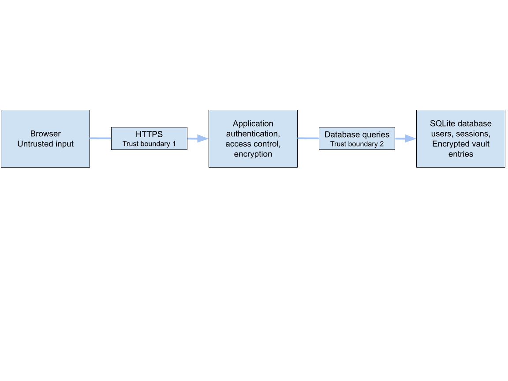

# Web-Based Secure Password Manager

# Checkpoint 1 — Threat Model and Architecture

## 1. Architecture and trust boundaries

The browser sends requests to the application over HTTPS. This is the first
trust boundary: input from the browser cannot be trusted, so the application
must validate it and check the user's permissions on every request.

The application encrypts sensitive vault data before writing it to the
database. This is the second trust boundary. The database stores encrypted
vault entries rather than plaintext account passwords. Decryption takes place
in the application when an authorized user requests an entry.

## 2. Threat model
The main assets are users' master passwords, saved website credentials,
encryption keys, and authenticated sessions. Possible entry points include
the registration and login forms, vault entry forms, entry IDs in URLs,
session cookies, and other HTTP requests sent from the browser. The threats
below describe how these entry points could be abused and how the application
plans to mitigate each risk.

An attacker may change an entry ID in the URL or modify a hidden form field
to access another user's saved credentials. This is input tampering and a
bypass of client-side controls. Unauthorized access to another user's entry
relates to OWASP A01:2025 Broken Access Control. The application will check
entry ownership on the server for every view, update, and delete request. It
will not trust an owner ID supplied by the browser.

An attacker may bypass a form's input length limit or disabled fields by
sending a modified HTTP request. Relying only on browser-side validation
would be an insecure design (OWASP A06:2025). The application will validate
input types, formats, and lengths on the server and reject invalid requests.

An attacker may put HTML into a website name to display a fake warning or
login form. This is HTML injection and content spoofing. The attacker may
also inject JavaScript that executes when the entry is displayed, causing
cross-site scripting (XSS). These threats relate to OWASP A05:2025
Injection. The application will escape user-provided content when displaying
it, avoid placing untrusted data into `innerHTML`, and use a restrictive
Content Security Policy.

If an attacker obtains a copy of the database, they may try to read saved
credentials or guess users' master passwords. This relates to OWASP
A04:2025 Cryptographic Failures. The application will store salted
master-password hashes and encrypt sensitive vault data on the server before
saving it. Plaintext passwords and derived encryption keys will not be
stored in the database.

An attacker may enter SQL syntax into a form field to change a database
query. This relates to OWASP A05:2025 Injection. The application will use
Django ORM queries instead of constructing SQL strings from user input.

A malicious website may try to make a user's browser submit an unintended
request to this application. This is cross-site request forgery (CSRF) and
relates to OWASP A01:2025 Broken Access Control. The application will require
CSRF tokens on login and on all forms that add, change, or delete data.

An attacker may also try to reuse a stolen session or set a known session ID
before the user logs in. This relates to OWASP A07:2025 Authentication
Failures. The application will use protected session cookies, expire
sessions, and change the session ID after login.

## 3. Cryptographic design

The master password has two separate uses. First, the application uses
Argon2id with a random salt to create a password hash for login
verification. Second, it uses Argon2id with a different random salt to
derive a vault encryption key. The login hash is not used as the
encryption key.

The application encrypts the account username and account password of
each vault entry on the server using AES-GCM. It generates a new random
nonce for each encryption operation. The website name remains unencrypted
so that users can see their list of entries before unlocking the vault.

The database stores the user's login name, salted password hash, vault
key-derivation salt, website names, encrypted entry data, and the nonce
needed for each entry. It does not store the master password, plaintext
account passwords, or the derived encryption key.

A login session identifies the user but does not store the vault key.
To add, view, or update sensitive entry data, the user re-enters the
master password. The server derives the key for that operation and does
not save it in the database or session.

## 4. Authentication and session design

Users will log in with their master password. The application will verify
it against the stored password hash. After a successful login, the
application will create a server-side session and issue a session cookie
to the browser. The cookie will contain only a session identifier, not
the master password or vault encryption key.

When the application is served over HTTPS, the session cookie will use
the Secure, HttpOnly, and SameSite=Strict attributes. Sessions will expire
after 30 minutes of inactivity. Logging out will invalidate the session.

The session identifier will be changed after a successful login so that
an attacker cannot make a user continue using a session ID known to the
attacker. This prevents session fixation. Multi-factor authentication,
such as a one-time code, may be added later but is not part of the initial
version.
